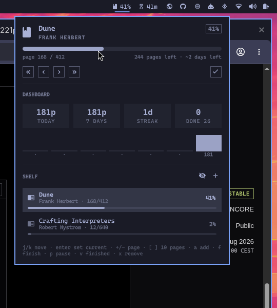

# Omashelf

A reading tracker for the [Omarchy](https://omarchy.org/) shell. The bar shows
how far you are into the book you're reading; the popup is a small reading
dashboard plus your whole shelf.



## What it does

- **Bar pill** — book icon plus the remaining/completed percentage of your
  current read. Scroll it or right/middle-click it to log a page without
  opening anything.
- **Now reading** — title, author, a progress track, page count, pages left,
  and an estimated "~N days left" based on your recent pace.
- **Mini dashboard** — pages today, pages over 7 days, current reading streak,
  and books finished this year, with a seven-day bar chart.
- **Shelf** — every book with its own progress track. Finished books are
  hidden until you ask for them.
- **Add books** from the panel, or from the bundled `omashelf` CLI.

Everything is stored in one JSON file that the widget watches, so the panel and
the CLI stay in sync without a restart.

## Install

```bash
omarchy plugin add https://github.com/daniel-felipe/omarchy-plugin-omashelf.git
omarchy plugin enable io.github.daniel-felipe.omashelf
```

Plugins land disabled so you can read the source first. To move the pill:

```bash
omarchy bar move io.github.daniel-felipe.omashelf --section right
```

## Remove

```bash
omarchy plugin disable io.github.daniel-felipe.omashelf
omarchy plugin remove io.github.daniel-felipe.omashelf
```

Your library file is left alone; delete
`~/.local/state/omarchy/omashelf/library.json` if you want it gone too.

## Keyboard

Inside the panel:

| Key | Action |
|-----|--------|
| `j` / `k` (or arrows) | Move through the shelf |
| `Enter` | Make the highlighted book the current read |
| `+` / `-` | Log one page forward/back |
| `]` / `[` | Log a big step (10 pages by default) |
| `a` | Add a book |
| `f` | Mark the highlighted book finished |
| `p` | Pause/resume the highlighted book |
| `v` | Show or hide finished books |
| `x` | Remove — press twice, the first press only arms it |
| `Esc` | Close |

Page keys act on the highlighted book once you've moved the cursor, and on
your current read before that; the controls row names the book when the two
differ.

Mouse: click a row to make it current, right-click to jump a big step forward,
middle-click to go back, scroll for single pages.

## CLI

`bin/omashelf` edits the same library file:

```bash
omashelf add "Dune" 412 "Frank Herbert"
omashelf read dune 30        # log 30 pages
omashelf page dune 168       # set the exact page
omashelf finish dune
omashelf list
omashelf stats
```

Put it on your `PATH` if you want it handy:

```bash
ln -s ~/.config/omarchy/plugins/io.github.daniel-felipe.omashelf/bin/omashelf ~/.local/bin/omashelf
```

## Settings

Configured per bar entry in `~/.config/omarchy/shell.json`, or through
Setup > Plugins.

| Key | Default | What it does |
|-----|---------|--------------|
| `barLabel` | `percent` | `percent`, `title`, `both`, or `icon` |
| `barTitleLimit` | `18` | Max title characters shown in the bar |
| `pageStep` | `10` | Pages moved by `]`/`[` and the `«` / `»` buttons |
| `libraryPath` | *(blank)* | Alternate library file |

```json
{ "id": "io.github.daniel-felipe.omashelf", "barLabel": "both", "pageStep": 25 }
```

## IPC

```bash
omarchy-shell omashelf toggle
omarchy-shell omashelf status     # "Dune — page 168/412 (41%) · ~2 days left"
omarchy-shell omashelf advance 20 # log 20 pages on the current book
```

## Library format

`~/.local/state/omarchy/omashelf/library.json`

```json
{
  "version": 1,
  "books": [
    {
      "id": "bk-...",
      "title": "Dune",
      "author": "Frank Herbert",
      "totalPages": 412,
      "currentPage": 168,
      "status": "reading",
      "started": "2026-08-01",
      "finished": "",
      "rating": 0,
      "log": [{ "date": "2026-08-23", "pages": 168 }]
    }
  ]
}
```

`status` is one of `reading`, `paused`, `finished`, `wishlist`. The `log`
entries are what the dashboard counts, so streaks and pace only reflect
progress you actually logged.

### Limits

The library file is plain JSON that you (or the CLI) can edit, so the plugin
treats it as untrusted input and refuses to let it grow without bound:

| Limit | Value | Enforced by |
| --- | --- | --- |
| Library file size | 1 MiB | The widget never opens the file itself. `bin/omashelf-io` opens the path once with `O_NOFOLLOW`/`O_NONBLOCK`, verifies on that descriptor that it is a regular file within the cap, and passes only those bounded bytes to the widget — so the bytes read are always the bytes that were measured. Over the cap (or not a regular file) nothing is loaded, nothing is written, and the panel says why; it re-checks about once a second. The CLI exits 1 with the same message. |
| Books | 500 | Extra books are dropped at parse time; `add` refuses past the cap. |
| Log entries per book | 400 | Oldest entries are dropped on read and on every CLI write. |
| Title / author length | 300 chars | Truncated at parse time and on `add`. |
| Markup in any label | removed | `<` and `>` are stripped from titles, authors and ids, along with control and bidi-override characters. Labels in the shell are painted by `Text` elements using Qt's default rich-text autodetection, so a title shaped like `` would otherwise make the shell fetch it. Stripping the angle brackets is what stops that detection; the plugin's own `Text` elements also set `textFormat: Text.PlainText`. The CLI applies the same rule, which additionally keeps a title carrying an ANSI escape from rewriting the terminal that ran `omashelf list`. |

Because writes are blocked whenever reads are, an oversized library is never
overwritten with the empty fallback — shrink it below the cap and the widget
picks it up again on its own. Writes go through the same helper: it refuses
anything over the cap, refuses a path that is not already a regular file, and
writes to a fresh file in the same directory that it renames into place, so the
library is never left half written.

A write the helper refuses is reported in the panel rather than dropped, and
the widget re-reads the file straight after, so the shelf on screen is never
showing a change that is not in the file. The `omashelf` CLI reads and writes
through that same helper, so it inherits all of it: it will not follow a symlink
planted at the library path, and it never leaves a partly written library
behind.

Titles and authors are rewritten in place by the first write that touches them —
a hand-edited library carrying markup keeps it until the widget or the CLI saves
that book, at which point the stripped form is what lands on disk.

## Dependencies

- Omarchy shell (Quickshell) — the plugin host.
- A Nerd Font for the icons; Omarchy ships one by default.
- `python3` — used by `bin/omashelf-io`, the helper the widget reads and writes
  the library file through, and by the optional `bin/omashelf` CLI.

## License

MIT — see [LICENSE](LICENSE).
